# 🤖 Siver WX机器人 (wxbot_plus)

[](https://github.com/SiverKing/SiverWXbot_plus)
[](https://www.python.org/)
[](LICENSE)

> 一个功能完整、架构清晰的WX机器人框架，支持多 AI 平台接入、多份 Prompt 管理、对话记忆、拆分多条回复、图片识别、自定义规则转发、灵活的监听模式、50+ 管理命令和智能的消息处理流程。

**作者**: [Siver](https://www.siver.top)

📖 **[查看完整使用文档](https://wxbot.siverking.online)**

---

## 项目简介
开源：https://github.com/SiverKing/SiverWXbot_plus/

一个功能完整、架构清晰的WX机器人框架，支持多 AI 平台接入、多份 Prompt 管理、对话记忆、拆分多条回复、图片识别、自定义规则转发、灵活的监听模式、50+ 管理命令和智能的消息处理流程。

本项目为基于`wxautox4`py库为内核，搭建并封装了实体功能的[开源](https://github.com/SiverKing/SiverWXbot_plus/)项目。可直接使用源码或exe快速部署，也可二次修改使用。本项目为开源项目，全部源代码免费开放不收取任何费用，仅供交流学习使用。wxautox4收费为内核库设备授权需要收费。若您拥有内核库授权，不仅可免费使用本项目，还可以自行开发或者使用其他基于内核库的项目。获取授权可查看README或者下方[安装部署](https://wxbot.siverking.online/docs.html?c=安装部署)内查看。当前有试用可获取，数量有限，先到先得。

## 安装部署

有两种方式可以运行本项目，**推荐新手选择方法一**。

### 方法一：直接使用可执行程序 exe（推荐新手）

**环境要求：**
- Windows 操作系统
- Windows wx PC 版（`4.1.7` ~ `4.1.8.101` 版本）

**下载地址（二选一）：**

> 💡 **Github 下载**：前往 [SiverWXbot_plus Releases](https://github.com/SiverKing/SiverWXbot_plus/releases) 下载打包好的 `.exe`，解压即用，无需安装 Python 和依赖。

> 💡 **蓝奏云下载**：前往 [蓝奏云链接（密码：1234）](https://wwbuf.lanzout.com/b00tcdnlte) 下载打包好的 `.exe`，解压即用，无需安装 Python 和依赖。

**使用方式：** 解压后找到一个文件夹存放 exe，双击打开 exe 运行即可。

---

### 方法二：下载[源码](https://github.com/SiverKing/SiverWXbot_plus)使用 Python 部署

**环境要求：**
- Python `3.9` - `3.12`
- Windows 操作系统
- Windows wx PC 版（`4.1.7` ~ `4.1.8.101` 版本）
- wxautox4内核库 设备授权（需购买，购买地址：https://www.siverking.online/static/img/siver_wx.jpg ）

**安装步骤：**

1. **克隆项目**
```bash
git clone https://github.com/SiverKing/SiverWXbot_plus.git
cd wxbot_plus
```

1. **安装依赖**
```bash
pip install -r requirements.txt
```

1. **启动机器人**
```bash
python web_server.py
```

---

两种方法均可完成部署，启动后会自动打开浏览器访问 `http://127.0.0.1:10001` 的管理面板。若未自动打开，请手动在浏览器中访问 `http://127.0.0.1:10001`。

---

## 管理面板使用

> ⚠️ **注意：** 在管理面板更改配置后，若机器人处于运行状态，需要将机器人**关闭后重新启动**以应用新配置！

> ⚠️ **注意：** 若感觉回消息时快时慢是正常的，设置了随机延时模拟人工耗时操作，防止操作过快！可在面板的其他配置里修改！

---

### 面板账密

首次进入面板按照提示输入默认账号密码登录。

| 项目 | 默认值 |
|------|--------|
| 用户名 | `admin` |
| 密码 | `123456` |

账密保存在 `config/admin.json`，可在面板内修改。

进入面板后，在左侧选择**账号密码**栏目，即可修改面板登录的用户名和密码。

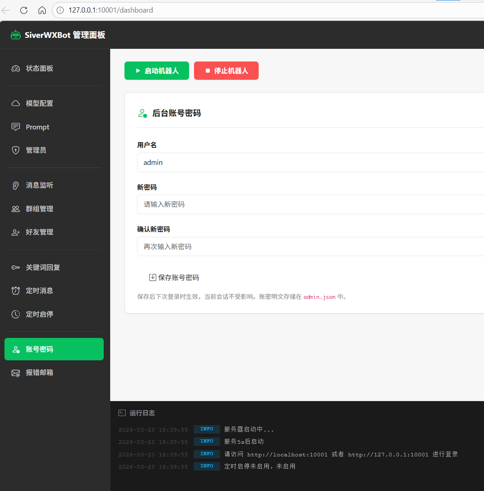

---

### 模型配置

此处以 [DusAPI](https://dusapi.com) 作为演示。

> ⭐ **推荐 DusAPI** - 兼容 Claude、GPT 等全系模型，国内稳定低延迟，一个 Key 搞定所有需求。

**配置步骤：**

1. 进入 [DusAPI](https://dusapi.com) 站点，点击右上角登录，按照要求注册并登录好账号。

2. 在 DusAPI 后台控制台，选择左侧的 **API 密钥**，然后点击右上角的**创建密钥**，名称填写 `wxbot`，分组选择你要用的模型厂家，即可点击创建。

   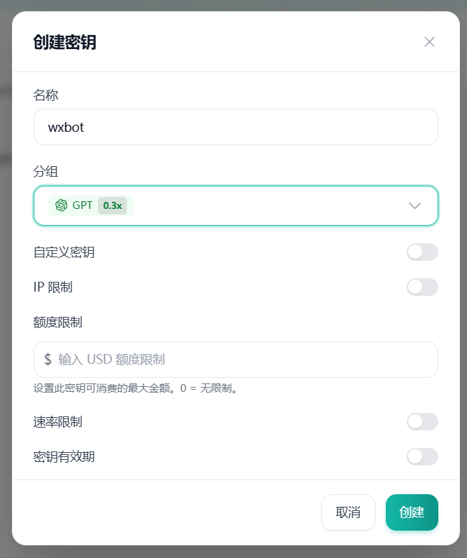

3. 创建完成后，点击密钥右侧的**复制按钮**复制密钥。

   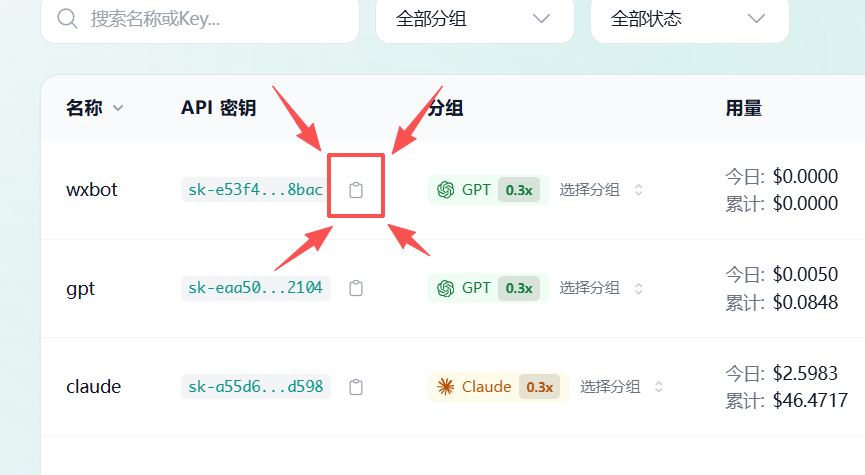

4. 回到管理面板，选择左侧**模型配置**，将复制的密钥粘贴到要使用接口的 **API Key** 中，SDK 选择 `DusAPI`，URL 会自动填写。若采用别的接口 SDK，请自行查阅使用方文档填写。

5. **填写模型 ID：** DusAPI 的模型根据你的 API 密钥分组填写，分组为 gpt 就填 gpt 类型的模型，为 claude 就填 claude 的模型。
   - 模型列表参考：https://docs.dusapi.com/guide/models.html
   - gpt 推荐：`gpt-5.4`
   - claude 推荐：`claude-sonnet-4-6`
   - 若选择其他兼容接口，参照底部注意事项填写模型内容。

   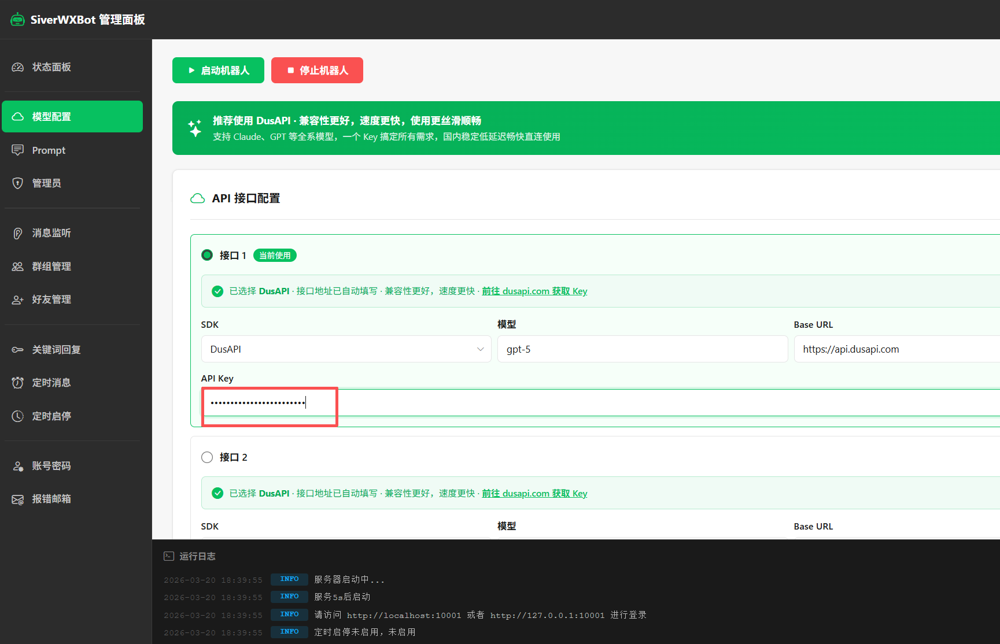

6. 模型配置完成。

---

### Prompt 配置

面板左侧 **Prompt** 栏目，用于定义 AI 的回复行为和语气内容。

- 简单示例：填写"你的所有回复后面都加一个喵~"
- 复杂示例：清晰地告诉 AI 自动回复的所有要求和任务
- 多prompt系统，可以存储多个prompt预设为每个监听单独使用设置

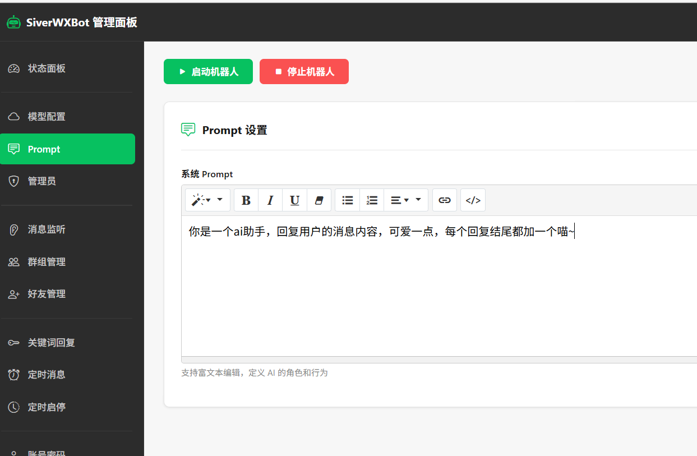

---

### 初步测试

配置好 Prompt 和模型配置后，即可进行初步测试。

程序接管wx运行时，请勿手动干预，避免影响自动化操作。尽量减少操作电脑的次数，最好不要去手动操作wx

1. 登录你的 Windows wx，注意版本要求与[安装部署](https://wxbot.siverking.online/docs.html?c=安装部署)内说的环境要求一致。

2. 保持 wx **主窗口开着**，不要打开 wx 的其他窗口，也不要最小化 wx。然后回到面板点击上方的 `启动机器人`，等待程序启动。

3. 大概等待十几秒后程序启动完成(启动过程中wx自动吸附到左侧为正常现象)，可以将面板弹窗点掉，查看面板下方日志是否启动成功。

4. 若是日志显示**初始化微信监听器失败**,就请重启wx后再启动重试，若是重启wx不行，就将wx和面板程序都关闭重启，若是还不行那就请根据**安装部署**里的环境要求检查wx版本

5. 在**手机 wx** 上给 `文件传输助手` 发送以下指令进行测试：
   - 发送 `/状态` → 查看是否运行成功
   - 发送 `/接口测试****`（将 `****` 替换成你要测试的话，如 `/接口测试你好`）→ 测试接口配置是否成功

6. 若配置和启动都没问题，将会触发自动回复。发送 `/指令` 可查看更多指令。测试成功可在状态面板查看当前运行状态。

7. 测试成功后，点击面板上的 `关闭机器人` 按钮，随后几秒后所有功能将被关闭。

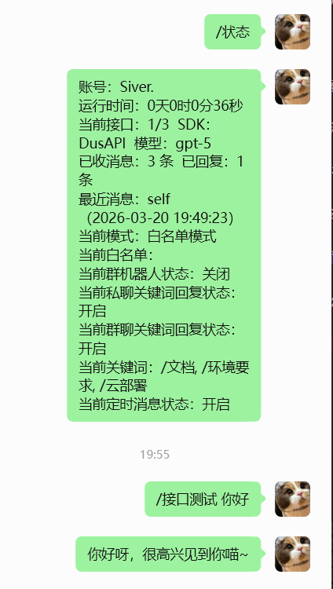

---

### 管理员配置

参照面板页面上的提示配置即可，建议保留 `文件传输助手`，或设置为自己的小号。

---

### 私聊监听配置

#### 双监听模式说明

| 模式 | 说明 |
|------|------|
| **白名单模式** | 精准监听指定个人用户（非群组，群组另外配置），只监听列表里设置的人员消息。填写给对方的**备注名**，即 wx 显示什么就填什么，否则无法监听。 |
| **黑名单模式** | 全局监听所有未读的红点消息（非群组，群组另外配置），动态管理会话列表。此时列表为黑名单，即黑名单的人员来消息时不会被处理。 |

- 全局监听（黑名单模式）：可以设置一个最大的全局监听prompt，AI回复接口采用模型配置里的默认选项
- 白名单模式：可以为每个监听对象设置不同的prompt和回复调用接口。

自行选择你需要的监听模式，填写好列表即可。

#### 启用私聊图片识别

支持通过调用dusapi的高级模型接口直接发送的图片及引用图片的识别。请在模型配置中添加配置一个Dusapi接口的高级模型(如claude4.6、gpt-5系列)用于图片识别。开启该功能后选中这个配置的接口即可

#### 启用拆分多条回复

启用后回复会根据接口ai抉择自动发送单条或者多条消息回复。可设置**单条最大字数**和**最多发送条数**

AI 将自主决定是否将回复拆分为多条消息逐条发送，模拟真人聊天。此功能通过在 Prompt 中注入格式指令，让 AI 自主决定是否拆分及条数，每条之间加入发送延迟模拟真人。
仅适用于支持自定义 Prompt 的接口（如 DusAPI）；Coze / Dify 等工作流类接口已在平台侧固化逻辑，此功能可能无效，推荐使用 DusAPI。

---

### 群组管理

勾选你想要的群组功能：

| 配置项 | 说明 |
|--------|------|
| 启用群聊回复 | 开启或关闭群聊监听 |
| 仅@时回复 | 群聊中是否仅在机器人账号被@时才回复 |
| 入群欢迎 | 是否开启新人入群欢迎功能 |
| 随机欢迎概率 | 设置触发入群欢迎的概率，拖动滑动条设置 |
| 欢迎消息 | 设置欢迎消息内容 |
| +添加群组 | 添加要监听的群组名称。若有群组备注名则采用备注名；若有同名群组，则给其中一个群组在 wx 中设置备注后，再添加备注名 |
| 启用群组图片识别 | 支持通过调用dusapi的高级模型接口直接发送的图片及引用图片的识别。请在模型配置中添加配置一个Dusapi接口的高级模型(如claude4.6、gpt-5系列)用于图片识别。开启该功能后选中这个配置的接口即可 |
| 启用拆分多条回复 | 启用后回复会根据接口ai抉择自动发送单条或者多条消息回复。可设置**单条最大字数**和**最多发送条数**。AI 将自主决定是否将回复拆分为多条消息逐条发送，模拟真人聊天。此功能通过在 Prompt 中注入格式指令，让 AI 自主决定是否拆分及条数，每条之间加入发送延迟模拟真人。`仅适用于支持自定义 Prompt 的接口（如 DusAPI）；Coze / Dify 等工作流类接口已在平台侧固化逻辑，此功能可能无效，推荐使用 DusAPI。` |

- 可以为每个群组设置不同的prompt预设和AI接口调用方便同时处理监听和完成每个群不同的功能服务。

#### 启用拆分多条回复

启用后回复会根据接口ai抉择自动发送单条或者多条消息回复。可设置**单条最大字数**和**最多发送条数**

AI 将自主决定是否将回复拆分为多条消息逐条发送，模拟真人聊天。此功能通过在 Prompt 中注入格式指令，让 AI 自主决定是否拆分及条数，每条之间加入发送延迟模拟真人。
仅适用于支持自定义 Prompt 的接口（如 DusAPI）；Coze / Dify 等工作流类接口已在平台侧固化逻辑，此功能可能无效，推荐使用 DusAPI。

---

### 好友管理

> ⚠️ **注意：** 自动通过新好友功能为 **30s ~ 300s** 随机时间检查，请耐心等待，检查到了就会自动通过！

| 配置项 | 说明 |
|--------|------|
| 自动通过新好友申请 | 开关是否自动通过新好友申请 |
| 新好友自动回复 | 开关是否自动给新通过的好友发送打招呼消息 |
| 添加消息 | 添加打招呼消息，可添加多条；也可填写图片的完整路径，程序会自动识别并发送图片（请勿骚扰其他用户） |

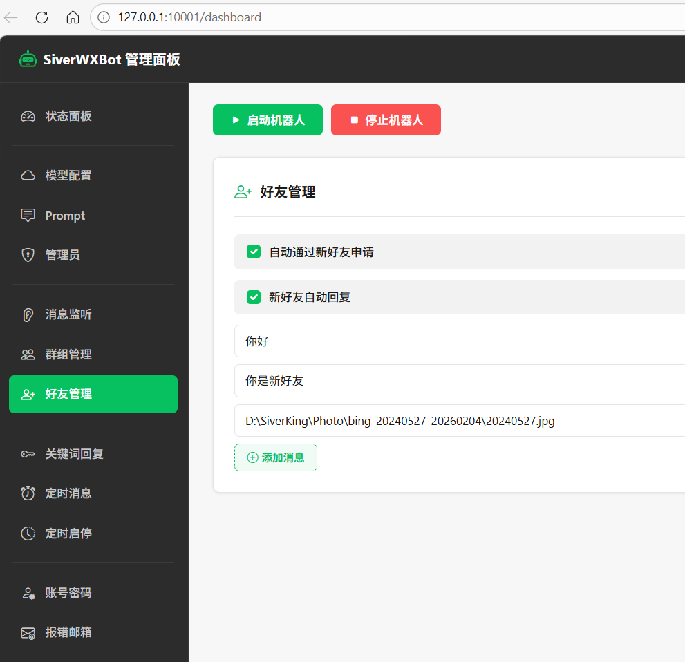  

---

### 关键词回复配置

配置群组和私聊的关键词直接回复。

| 配置项 | 说明 |
|--------|------|
| 私聊关键词回复 | 开关私聊关键词回复 |
| 群聊关键词回复 | 开关群聊关键词回复 |
| 仅在被 @ 时触发群聊关键词回复 | 开关群聊是否被@时才触发关键词 |
| 添加关键词 | 左侧填写关键词，右侧填写对应的回复内容 |

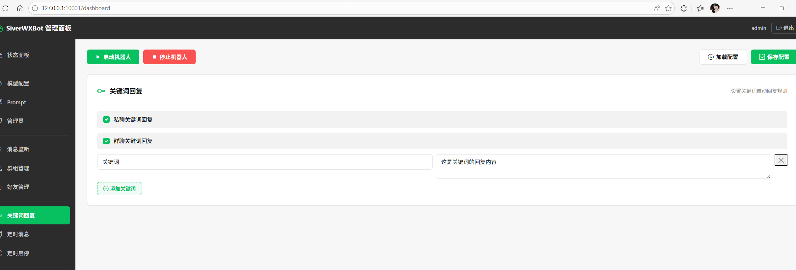  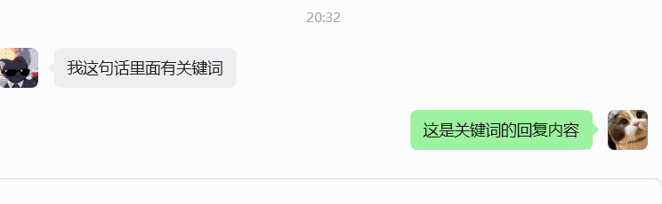

---

### 自定义转发

可以在此开启自定义转发功能，添加自定义转发任务，根据页面提示设置好自定义转发的来源、转发规则、转发目标后，启动机器人后就会监听消息并自定义转发。和私聊监听、群组监听可共存并不冲突。

---

### 定时消息

参照页面内容配置定时消息即可。若机器人一直运行着，达到定时时间时，就会触发定时消息任务并发送消息。

---

### 朋友圈

#### 随机朋友圈点赞

设置后会在规定的随机时间内打开朋友圈并点赞第一条，用于活跃账号。

#### 随机定时朋友圈

依照页面提示设置随机窗口时间发布朋友圈，防止固定时间跳过机械化。

#### 定时朋友圈

参照页面内容配置定时朋友圈即可。若机器人运行着，达到定时时间时，就会触发定时朋友圈任务并自动发布朋友圈。

---

### 定时启停

选择并配置是否定时开启机器人和关闭机器人。

---

### 记忆管理

开启后机器人运行时的所有消息将写入记忆文件，AI 回复时携带历史上下文

⚠️ 提示：推荐存储 500 条，AI 带入 100 条。数值越大 token 消耗越多，请根据实际需求调整。

- 启用对话记忆：开启后机器人运行时的所有消息将写入记忆文件，AI 回复时携带历史上下文。记忆文件路径为 `memory/[wx号]/[窗口名]/[窗口名]_memory.json`
- 存储条数建议根据推荐配置

#### 记忆查看

可以在线查看和删除已经存储的记忆

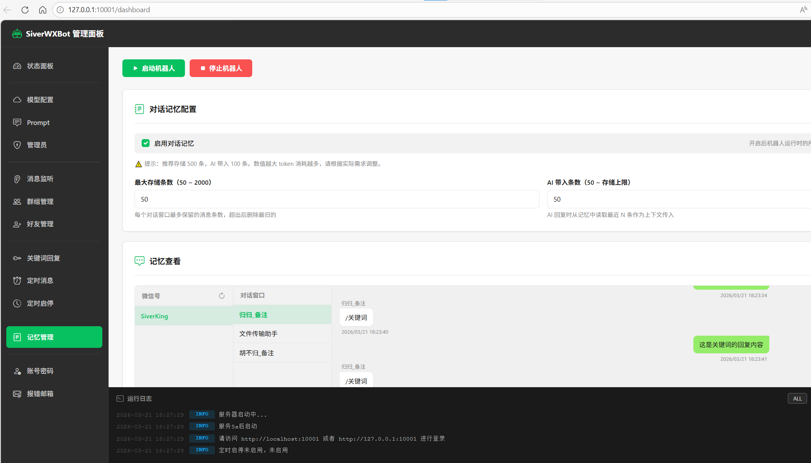
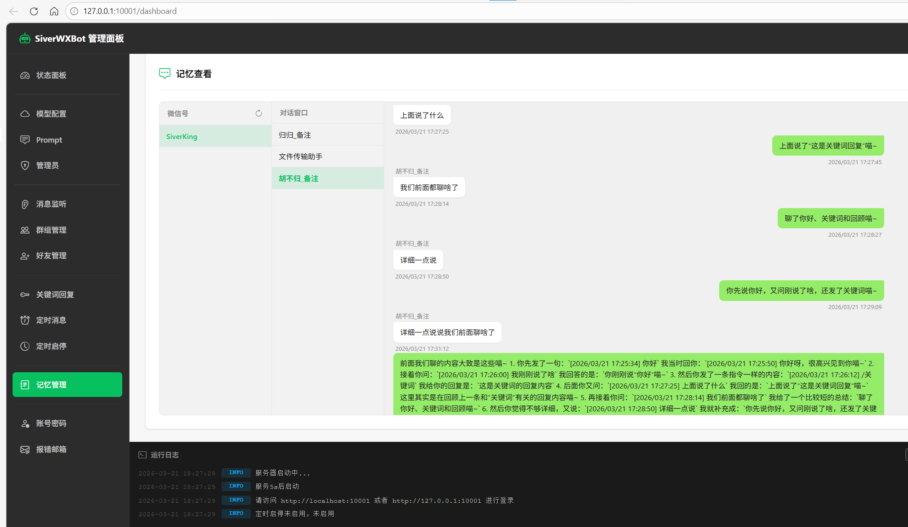

---

### 其他配置

#### 启用发送延迟

可配置模拟人工操作延时功能。配置好后发送消息前会进行随机等待以模拟人工。

#### 接口调用失败固定回复

当调用 AI / 模型接口失败时，机器人将发送此固定回复，而非原始报错提示。

---

### 报错邮箱

提供报错邮件和 wx 离线邮件提醒，按照页面提示配置邮箱即可。

---

### 数据备份

可备份配置数据

---

### 消息指令调用参考

采用管理员消息指令控制，红框为系统自动发送消息，非红框为人工发送消息。按照图内使用测试即可。

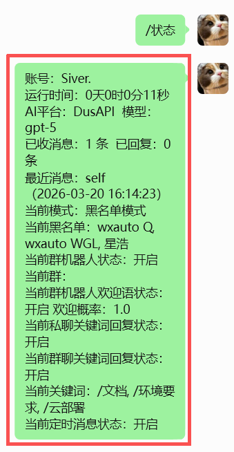 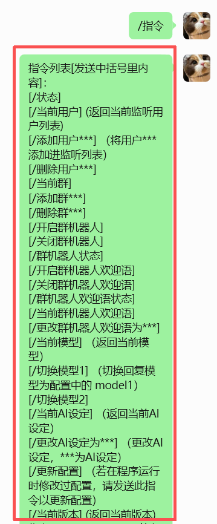 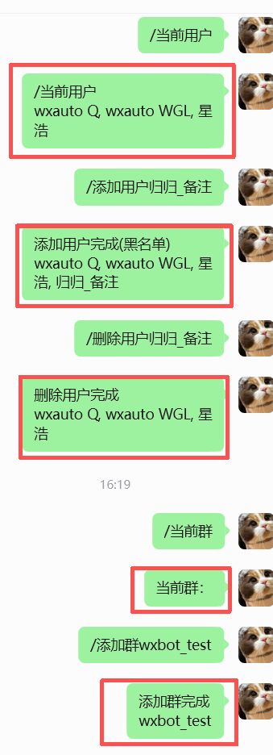 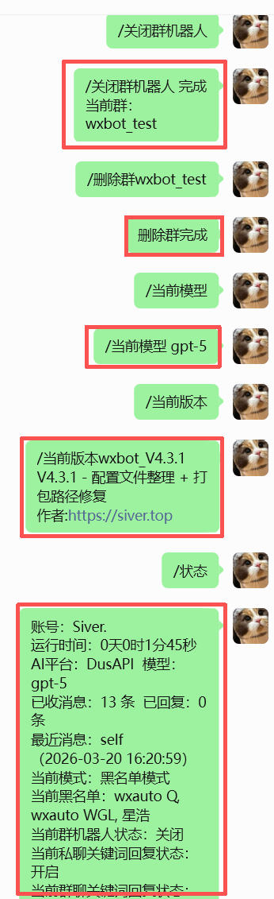

---

---

## 注意事项

1. 启动机器人时不得有wx小窗口（只保留主窗口），同时确保主窗口没有最小化。
2. 电脑自动休眠 黑屏都设为**从不**（一般情况程序会自动阻止不用手动调整）。
3. 如需离线邮件提醒，请在配置面板修改设置邮件。
4. 关闭wx自动更新。
5. 适配 Windows wx `4.1.7` - `4.1.8.101`。
6. 程序接管wx运行时，请勿手动干预，避免影响自动化操作。
7. **各 SDK 接口填写说明：**
   - **DusAPI**：填写 Key 和模型 ID，模型 ID 可从 https://docs.dusapi.com 查看
   - **OpenAI SDK**：填写 Key、URL、模型
   - **Dify**：填写 Key、URL，模型 填写 Dify 的工作流 ID
   - **Coze**：仅需填写 Key，模型 填写 Coze 智能体 bot_id，无需填写 URL

---

## 常见问题

### Q: 会封号吗？

**A:** **该项目基于`wxautox4`,`wxautox4`基于Windows官方API开发，不涉及任何侵入、破解、抓包微信客户端应用，完全以人操作微信的行为执行操作**

但是如果你有以下行为，**即使手动操作**也有风控的风险：

- 曾用hook类或webhook类微信工具，如dll注入、itchat及其衍生产品
- 频繁且大量的发送消息、添加好友等，导致风控
- 高频率发送机器人特征明显的消息，导致被人举报，致使行为风控
- 扫码手机与电脑客户端不在同一个城市，导致异地风控
- 低权重账号做太多动作，低权重账号可能包括：
  - 新注册账号
  - 长期未登录或不活跃账号
  - 未实名认证账号
  - 未绑定银行卡账号
  - 曾被官方处罚的账号
...

### Q: 跟wxautox4什么关系？

**A:** wxautox4为python库，和该项目为两个独立的东西。该项目基于wxautox4开发封装，可以理解成以wxautox4为内核的软件。联系本项目作者，即可获得wxautox4授权。

### Q: 为什么运行不正常如图片下载失败、获取不到消息、消息发送人获取不正常

**A:** 此为受windows系统屏幕缩放影响。请进入windows设置找到屏幕设置，将缩放调整为100%使用即可正常。

### Q: 为什么运行时wx会被自动吸附到左侧并且上下拉宽？

**A:** 为正常现象，这是方便软件进行自动化识别和操作最佳设置。请勿手动调整避免影响到自动化

### Q: 为什么有时会有wx窗口自动弹出？

**A:** 此为在自动化操作过程，正常现象。程序接管wx运行时，请勿手动干预，避免影响自动化操作。尽量减少操作电脑的次数，最好不要去手动操作wx

### Q: 能不能最小化？

**A:** **不能**。模拟操作自动化，需要跟真人一样，有窗口开着才能操作。

### Q: 其他AI/SDK接口如何接入？

**A:** 参照[注意事项](https://wxbot.siverking.online/docs.html?c=注意事项)或者查看[源码](https://github.com/SiverKing/SiverWXbot_plus/)。

### Q: 有没有数据安全，微信隐私问题？

**A:** 参照[隐私政策](https://wxbot.siverking.online/docs.html?c=隐私政策)。

### Q: 配置了DusAPI不能用？

**A:** 登录[DusAPI后台](https://dusapi.com/dashboard)，查看是否还有余额，密钥配置是否正确。若都正常可以尝试联系作者为你解答。

### Q: 如何获取授权、激活？

**A:** [联系作者](https://www.siverking.online/static/img/siver_wx.jpg)

### Q: 运行提示防火墙？

**A:** 同意或者确认即可。

### Q: mac、linux能不能用？

**A:** **不能**。只支持x86架构的Windows。

### Q: 不会写prompt（提示词）？

**A:** 随便找一个AI，告诉他你的需求，让他给你写一份prompt模板，自行修改即可。或者上网搜索prompt模板。

### Q: 为什么api接口要收费？ ？

**A:** API接口消耗Token，需要消耗接口提供商的算力资源。如果不需要AI回复，也可以使用关键词回复、定时消息、自动通过好友申请并打招呼等没有用到AI接口的功能。

### Q: 我想自己开发/更改？ 

**A:** 完全可以，代码完全开源。只要拥有wxautox4内核库设备授权，自行拉取源码修改即可。或者自行基于wxautox4内核库开发别的项目

### Q: 如何更新？ 

**A:** 拉取最新的源码或者下载最新的exe，放到你旧版本的运行目录里替换或者直接使用即可。或者将旧运行目录的`config/` `memory/`文件夹备份，然后放在新的运行目录即可调用旧数据。更新前建议您备份旧运行目录的 `config/` `memory/` 文件夹，避免数据丢失。

---

## 用户协议

最后更新日期：2026年03月22日

感谢您使用 SiverWXbot_plus（以下简称“本项目”）。为明确用户责任，特制定本用户协议（以下简称“协议”）。请在使用前仔细阅读并同意以下条款。您使用本项目即视为您已接受并同意遵守本协议。

使用许可及限制

### 1. 合法用途

用户应仅将本项目用于合法用途，包括但不限于：

- 个人学习和研究。

- 在不违反适用法律法规及第三方协议（如[微信用户协议](https://weixin.qq.com/cgi-bin/readtemplate?&t=page/agreement/personal_account&lang=zh_CN)）的情况下个人使用。

### 2. 禁止行为
   
用户不得将本项目用于以下用途，包括但不限于：

- 不得使用本项目开发、分发或使用任何违反法律法规的工具或服务。

- 不得使用本项目开发、分发或使用任何违反第三方平台规则（如[微信用户协议](https://weixin.qq.com/cgi-bin/readtemplate?&t=page/agreement/personal_account&lang=zh_CN)）的工具或服务。

- 不得使用本项目从事任何危害他人权益、平台安全或公共利益的行为。

- 不得将本项目用于商业用途，包括但不限于开发、销售或以任何方式直接或间接获利的行为。

- 不得将SiverWXbot_plus的源代码、修改版本或任何与本项目相关的内容发布至公共平台，也不得通过任何形式进行公开传播或分享。

### 3. 风险与责任
   
用户在使用本项目时，须自行确保其行为的合法性及合规性。 任何因使用本项目而产生的法律风险、责任及后果，由用户自行承担。用户应确保其使用行为不违反任何适用的法律法规及相关协议，且不侵犯第三方的权益。

---

## 隐私政策

最后更新日期：2026年03月22日

### 1. 概述

感谢您使用 SiverWXbot_plus（以下简称“本项目”）。本隐私政策说明我们如何收集、使用和保护您的信息。

### 2. 信息收集

我们不收集任何信息。

本项目明确不会收集、传输或存储以下任何信息：

- 账号信息（用户名、密码、手机号等）
- 聊天记录及消息内容
- 联系人信息
- 任何其他用户数据

记忆功能所有产生的数据均在本地运行目录`memory/[wx号]/`内，并且记忆功能有明确开关可以关闭。

### 3. 本地操作声明

本项目所有自动化操作均在用户本地设备上执行，不会将任何操作数据上传至服务器，用户对本地数据拥有完全控制权。

### 4. 隐私政策更新

本政策如有重大变更，将通过项目页面或适当方式通知用户。

### 5. 免责声明

本项目仅供学习和研究使用，请遵守微信用户协议及相关法律法规，勿用于任何违法或侵权行为。使用本项目即表示您已同意本隐私政策。

---

## 交流

**项目地址**：[https://github.com/SiverKing/SiverWXbot_plus](https://github.com/SiverKing/SiverWXbot_plus)

**作者主页**：[https://www.siver.top](https://www.siverking.online)

**wxautox4内核库授权激活**: [wxautox4内核库授权激活](https://www.siverking.online/static/img/siver_wx.jpg)

**联系作者**: [联系作者](https://www.siverking.online/static/img/siver_wx.jpg)

**交流群**：

---


