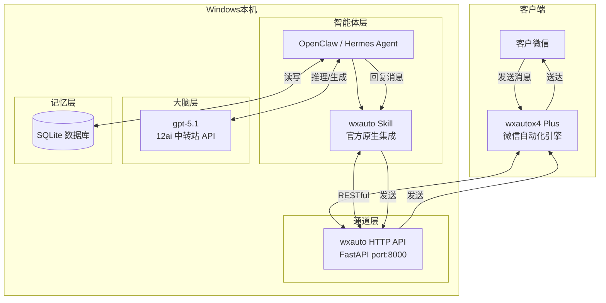
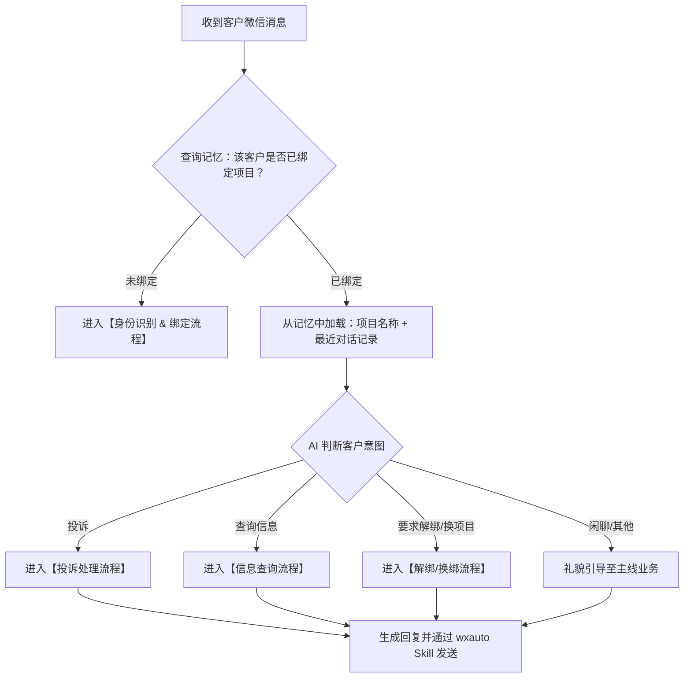
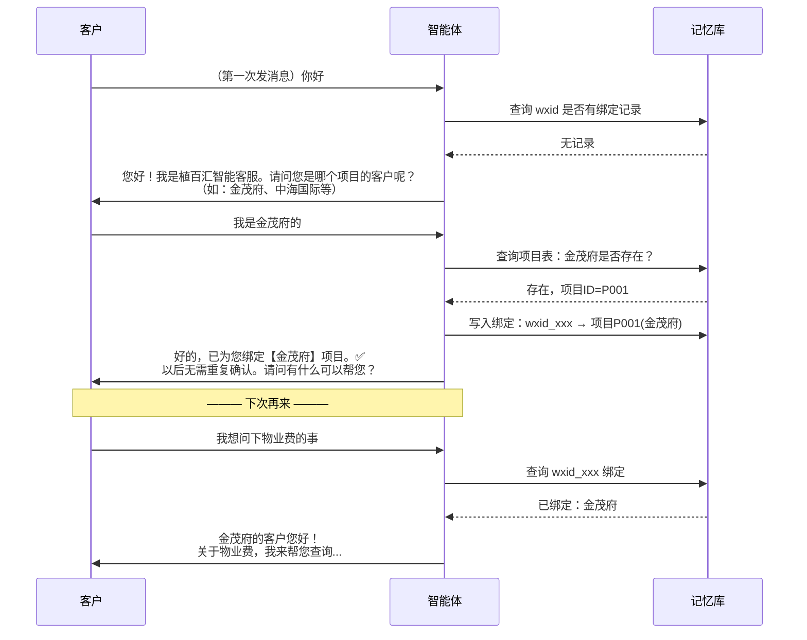
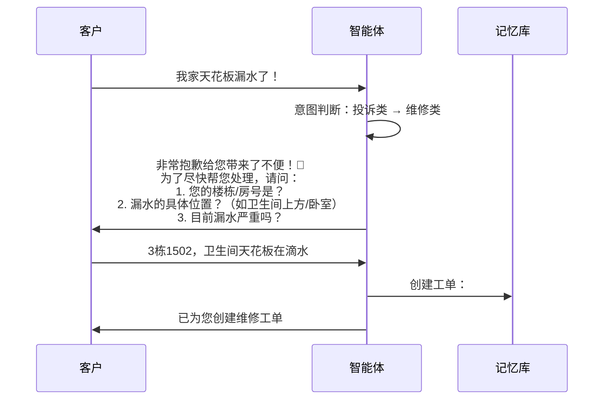
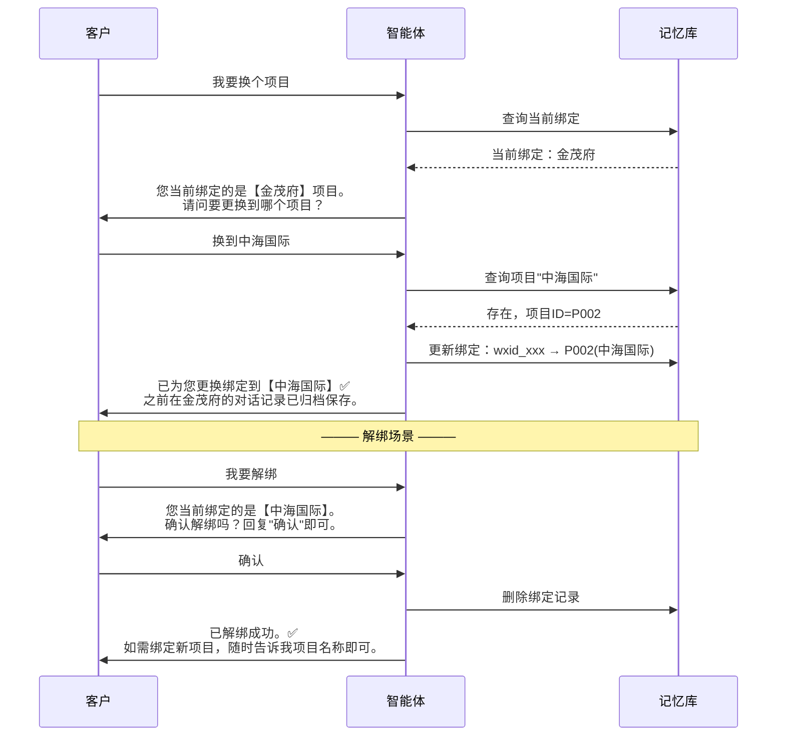
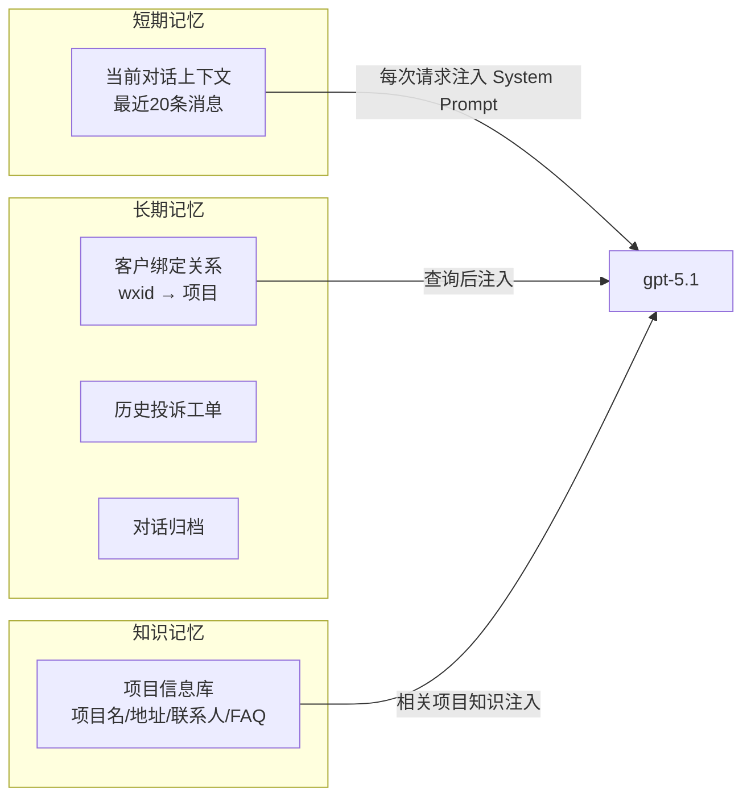
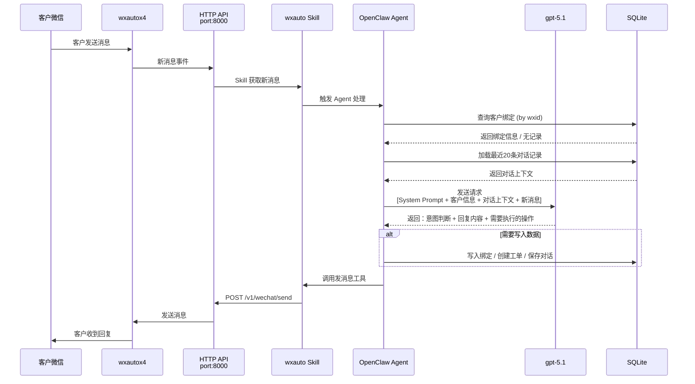

# 植百汇智能客服特工系统 — 整体架构方案

## 一、项目背景

植百汇是科技实力领先的健康空间服务商，累计服务全国近 1000 家企事业单位。当前需要建设一套**基于微信的智能客服系统**，实现：

1. 自动识别客户身份（属于哪个项目）
2. 判断客户意图（投诉 or 查询）
3. 按智能体逻辑自动处理或转人工
4. 支持客户-项目绑定/解绑，绑定后永久记忆

---

## 二、技术选型与决策依据

| 层级 | 选型 | 为什么选它 |
|------|------|-----------|
| **微信通道** | wxautox4 Plus + HTTP API | 官方支持 OpenClaw Skill，27+ RESTful 接口完整覆盖收发消息、群管理 |
| **智能体框架** | OpenClaw (Hermes Agent) | wxautox 官方原生支持的智能体生态；自带记忆池、工具链、Skill 扩展 |
| **大模型** | gpt-5.1 (经 12ai 中转站) | 已验证可用；中文理解力和推理链深度足够 |
| **持久化** | SQLite | 轻量、零运维、OpenClaw 原生支持 |
| **运行环境** | Windows 本机 | wxautox4 仅支持 Windows；全链路本地化，无跨平台桥接风险 |

> [!IMPORTANT]
> **关键决策**：所有组件均运行在 Windows 本机，不经过 WSL。避免 WSL2 NAT 网络桥接不稳定带来的 7×24 可靠性风险。

---

## 三、系统分层架构



### 四层职责说明

| 层级 | 角色 | 具体职责 |
|------|------|---------|
| **通道层** | wxautox4 + HTTP API | 纯粹的"手和嘴"，负责收发微信消息，不做任何业务判断 |
| **智能体层** | OpenClaw + wxauto Skill | "神经中枢"，接收消息 → 调度大脑推理 → 查询记忆 → 组织回复 → 通过 Skill 发回 |
| **大脑层** | gpt-5.1 | "智商"，负责理解客户意图、生成回复话术、做多轮推理 |
| **记忆层** | SQLite | "长期记忆"，存储客户绑定关系、对话历史、投诉工单、项目知识库 |

---

## 四、核心业务流程

### 4.1 总调度流程



### 4.2 身份识别 & 绑定流程



### 4.3 投诉处理流程



### 4.4 解绑 & 换绑流程



---

## 五、记忆系统设计

### 5.1 记忆分层模型



### 5.2 数据库表结构

#### `projects` — 项目信息表

| 字段 | 类型 | 说明 |
|------|------|------|
| id | TEXT PK | 项目编号 P001 |
| name | TEXT | 项目名称（如"金茂府"） |
| address | TEXT | 项目地址 |
| contact_person | TEXT | 项目负责人 |
| contact_phone | TEXT | 联系电话 |
| service_scope | TEXT | 服务范围描述 |
| faq | TEXT | 常见问题JSON（物业费、绿化养护周期等） |
| created_at | DATETIME | 创建时间 |

#### `customers` — 客户绑定表

| 字段 | 类型 | 说明 |
|------|------|------|
| id | INTEGER PK | 自增ID |
| wxid | TEXT UNIQUE | 微信唯一标识 |
| wx_name | TEXT | 微信昵称 |
| project_id | TEXT FK | 绑定的项目ID |
| bindStatus | TEXT | active / unbound |
| bindTime | DATETIME | 绑定时间 |
| unbindTime | DATETIME | 解绑时间（如有） |

#### `conversations` — 对话记录表

| 字段 | 类型 | 说明 |
|------|------|------|
| id | INTEGER PK | 自增ID |
| wxid | TEXT | 客户微信ID |
| role | TEXT | customer / agent |
| content | TEXT | 消息内容 |
| intent | TEXT | 意图分类（complaint/query/bindchange/chat） |
| timestamp | DATETIME | 消息时间 |

#### `tickets` — 投诉工单表

| 字段 | 类型 | 说明 |
|------|------|------|
| id | TEXT PK | 工单号 TK20260414001 |
| wxid | TEXT | 投诉客户 |
| project_id | TEXT | 所属项目 |
| category | TEXT | 投诉类别（漏水/噪音/绿化/物业费等） |
| description | TEXT | 问题描述 |
| room_info | TEXT | 楼栋房号 |
| status | TEXT | pending/processing/resolved/escalated |
| priority | TEXT | low/medium/high/urgent |
| created_at | DATETIME | 创建时间 |
| resolved_at | DATETIME | 解决时间 |
| resolution | TEXT | 解决方案 |

---

## 六、智能体人设设计 (System Prompt)

```markdown
# 角色定义
你是"植小慧"，植百汇公司的智能客服专员。
植百汇是科技实力领先的健康空间服务商，为用户提供一整套科学的健康办公空间解决方案。

# 核心能力
1. 客户身份识别：通过微信ID识别客户，确认其所属项目
2. 意图判断：精准判断客户是要投诉、查询信息、还是变更绑定
3. 投诉处理：收集投诉信息，创建工单，安抚情绪
4. 信息查询：基于项目知识库回答常见问题

# 对话规则
- 首次联系的客户，必须先引导绑定项目，再处理业务
- 已绑定的客户，开头用"【项目名】的XX您好"问候
- 投诉场景：先共情安抚，再收集信息，最后给出处理方案和工单号
- 查询场景：直接从知识库检索回答，答不上来的诚实告知并转人工
- 语气要求：亲切但专业，不卑不亢，禁止机械化套话

# 记忆使用规则
- 每次对话前，系统会注入该客户的绑定信息和最近20条对话
- 你必须利用这些上下文保持对话连贯性
- 客户提到"上次那个事"时，必须从历史记录中准确定位

# 边界约束
- 你不能承诺具体的赔偿金额或法律责任
- 无法解决的问题，回复"我已将您的问题升级给项目负责人XXX，TA会在X小时内联系您"
- 绝不泄露其他客户的信息
- 绝不编造不存在的项目或服务内容
```

---

## 七、消息处理时序（完整链路）



---

## 八、部署架构

```
D:\植百汇客服系统\
├── wxauto-restful-api\          # wxautox HTTP 服务
│   ├── config.yaml              # 服务配置 (port, token)
│   ├── run.py                   # 启动脚本
│   └── data\
│       └── wxautox.db           # wxautox 内部数据
│
├── agent\                       # 智能体核心
│   ├── system_prompt.md         # 客服人设指令
│   ├── project_knowledge.json   # 项目知识库
│   └── customer_service.db      # 客户/工单 SQLite 数据库
│
└── startup.bat                  # 一键启动脚本
    # 1. 启动 wxautox HTTP 服务
    # 2. 启动 OpenClaw Agent
```

### 启动流程

```batch
@echo off
echo [1/2] 启动 wxautox HTTP API 服务...
start /b cmd /c "cd wxauto-restful-api && python run.py"
timeout /t 3

echo [2/2] 启动智能客服 Agent...
start /b cmd /c "cd agent && openclaw start"

echo ✅ 植百汇智能客服系统已启动
echo    wxautox API: http://localhost:8000
echo    等待客户微信消息...
pause
```

---

## 九、实施步骤

### Phase 1：环境搭建（Day 1）
- [ ] Windows 上安装 OpenClaw（不用 WSL）
- [ ] 确认 wxautox4 Plus 已激活
- [ ] 克隆并启动 wxauto-restful-api
- [ ] 安装 wxauto Skill 到 OpenClaw
- [ ] 验证：通过 Agent 发微信给"文件传输助手"

### Phase 2：数据准备（Day 2）
- [ ] 创建 SQLite 数据库和表结构
- [ ] 录入项目信息（项目名、地址、负责人、FAQ）
- [ ] 编写智能体 System Prompt

### Phase 3：核心流程开发（Day 3-4）
- [ ] 实现客户身份识别 & 绑定流程
- [ ] 实现投诉处理流程（收集信息 → 创建工单）
- [ ] 实现信息查询流程（检索项目知识库）
- [ ] 实现解绑/换绑流程

### Phase 4：记忆系统调优（Day 5）
- [ ] 对话历史注入机制
- [ ] 上下文窗口管理（最近 N 条）
- [ ] 绑定状态持久化验证

### Phase 5：上线与监控（Day 6-7）
- [ ] 内部测试：用测试微信号模拟各种场景
- [ ] 异常处理：网络断开、API 超时、模型报错
- [ ] 编写 startup.bat 一键启动脚本
- [ ] 正式上线：接入真实客户微信

---

## 十、待讨论事项

> [!IMPORTANT]
> 以下问题需要老板确认，将直接影响实施细节：

1. **项目数据**：目前有多少个在服项目？能否提供一份项目清单（项目名 + 地址 + 联系人）？
2. **投诉分类**：常见的投诉类型有哪些？（漏水、噪音、绿化、物业费纠纷...）
3. **知识库内容**：客户最常问的问题是什么？（物业费金额、缴费方式、绿化养护周期...）
4. **转人工机制**：哪些情况必须转人工？转给谁？（项目负责人/客服主管？）
5. **多账号问题**：这个客服微信是一个专属服务号？还是挂在某个员工的个人微信下？
6. **是否需要群聊支持**：客户是私聊联系，还是在项目群里@客服？
